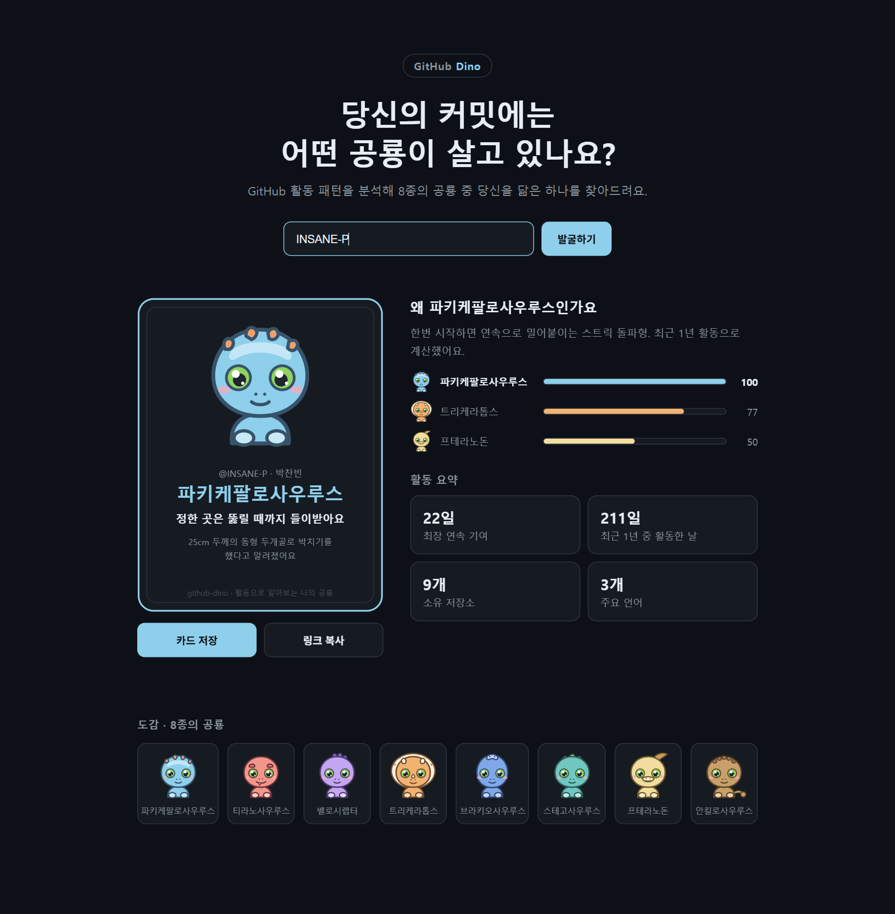
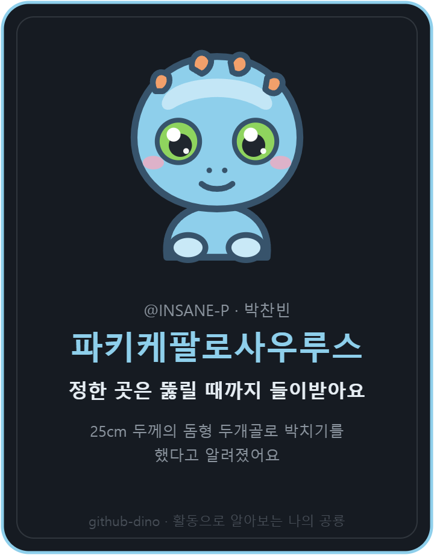

# github-dino

GitHub 활동 패턴을 분석해 8종의 공룡 중 나를 닮은 하나를 찾아주는 웹 앱입니다.
Relay와 GitHub GraphQL API를 공부하면서 만든 프로젝트입니다.



## 어떻게 판정하나요

최근 1년의 기여 데이터를 GitHub GraphQL API로 가져와 8가지 지표로 점수를 매기고, 가장 높은 공룡으로 판정합니다.

| 공룡 | 지표 |
| --- | --- |
| 파키케팔로사우루스 | 최장 연속 기여 스트릭 |
| 티라노사우루스 | 받은 스타 수 |
| 벨로시랩터 | 전체 기여 중 PR 비중 |
| 트리케라톱스 | 1년 중 활동한 날의 비율 |
| 브라키오사우루스 | 소유 저장소 수 |
| 스테고사우루스 | 리뷰와 이슈 비중 |
| 프테라노돈 | 주요 언어 수 |
| 안킬로사우루스 | 하루 최대 기여 비중 |

판정 결과는 카드로 저장하거나 `?u=아이디` 링크로 공유할 수 있습니다.



공룡 캐릭터 8종은 전부 직접 그린 오리지널 SVG입니다.

## 기술 스택

- React 19 + TypeScript + Vite
- Relay 21 + GitHub GraphQL API

Relay의 선언적 데이터 페칭을 실제 API에 붙여보는 것이 목표였습니다. relay-compiler가 생성한 타입으로 응답을 다루는 것에서 시작해, 카드가 읽는 사용자 필드는 `DinoCard_user` fragment로 콜로케이션하고, 저장소 목록은 `usePaginationFragment`와 `@connection`으로 페이지네이션을 붙였습니다.

## 실행 방법

```bash
pnpm install
cp .env.local.example .env.local   # VITE_GITHUB_TOKEN에 GitHub 토큰 입력
pnpm relay
pnpm dev
```

토큰은 public 데이터 읽기 권한만 있으면 됩니다.
